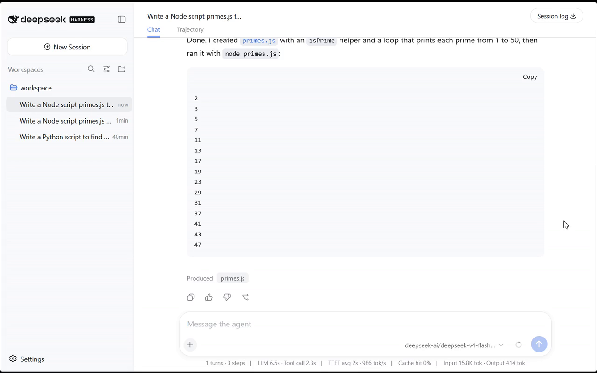

# dsh-cloud

Run [DeepSeek Harness](https://github.com/deepseek-ai/deepseek-harness) on Cloudflare.
Serverless, hibernates when idle, and **keeps working after you close the tab**.

> **Unofficial.** Not affiliated with DeepSeek. This is a third-party port of
> their open-source agent harness to Cloudflare Workers.

Deploy it to **your own** Cloudflare account. You bring the account and the model
key; nothing here asks you to sign up for anything of ours.

<!-- Two references to one video, deliberately.

     The bare URL below is a GitHub attachment, and only that shape becomes an
     inline player: it exists because the file was uploaded through GitHub's web
     UI. A `raw` link to the committed copy will not play -- raw.githubusercontent
     serves mp4 with a content-type the renderer does not treat as video.

     The attachment renders only on github.com, and it lives on GitHub's CDN
     rather than in this repository, so it survives a rename and cannot be
     removed by a commit. The poster underneath is the copy that works in a
     clone, on another host, and offline. Keep media/demo.mp4 committed. -->

https://github.com/user-attachments/assets/2fb87efd-3530-4392-94ae-f9161183ea47

[](https://github.com/dorisgyl/dsh-cloud/raw/main/media/demo.mp4)

*36 seconds: the agent writes `primes.js`, runs it with `node`, and shows the
output — the model, the filesystem and the shell in one turn, on a live
deployment.*

## Try the demo

**<https://dsh-cloud-demo.nevoflux.app/>**

Sign in with **GitHub**, and **star this repository** — the deployment admits
GitHub accounts that have starred it, and nobody else. The star list refreshes
about once a minute, so a star given just now takes a moment to take effect.

That gate is not decoration; it is the admission control described further down,
running. Someone has to pay for every model turn, container second and browser
second an agent spends, and on this deployment that is one person.

---

## Status: work in progress

What runs today, verified against a real deployment:

| | |
|---|---|
| Upstream agent tree assembles inside a Worker | yes — 88 packages, 266 ms |
| Turns run in a Durable Object and survive the client leaving | yes |
| Session log persists to Durable Object SQLite | yes |
| Edge with Cloudflare Access and per-user sharding | yes |
| A real model | yes — Workers AI, no API key |
| Shell — real commands in a Cloudflare container | yes |
| Files — read / write / edit, same execution world as the shell | yes |
| Terminal — a real PTY, state kept across turns | yes, but the default `bash` tool stays one-shot |
| The dsh web UI | yes — served, and its protocol works end to end |
| Third-party plugins, installed without a redeploy | yes — isolated, no network of their own (`packages/cf-plugin-hostins.md`) |
| Workspace files surviving container recycling | **no** — see Limitations |

See `docs/parity.md` for a feature-by-feature comparison against the upstream
harness, including what is deliberately absent and why.

## Limitations

**Workspace files do not survive the container being recycled.** Cloudflare
containers sleep and are reclaimed; `/workspace` then comes back fresh from the
image. Files an agent wrote minutes earlier are simply gone, while the workspace
*record* — which lives in Durable Object SQLite — is still there, pointing at a
directory that no longer exists.

A workspace is therefore useful **within the session that created it** and not
beyond. Design 6.3 plans for this (a lease plus snapshot hibernation, which the
Sandbox SDK's `createBackup`/`restoreBackup` would carry); it is not built. The
web UI here is a demonstration, and this is the limit that matters most when
treating it as more than that.

**Every Access user is isolated, and that part is real.** The edge derives the
Durable Object name entirely from verified Access claims —
`tenant/<tenant>/user/<user>/session/<id>` — so each user gets their own object,
its own SQLite, and its own container. A user cannot address another user's
object: the caller contributes only the session segment, and only inside its own
prefix. Sessions belonging to one user share that user's container deliberately.

**One model, one region, no quotas.** There is no per-user rate limiting, no
spend cap and no admission control. Opening a deployment to the public means
paying for whatever it is asked to do.

## Tiers

Execution is pluggable, and all three tiers are the **same build** — the tier is
decided by which bindings exist, not by which code you compile.

| Tier | Execution backend | You need | Capability |
|---|---|---|---|
| **Minimal** | none | Workers Paid | chat + web tools |
| **Standard** | Cloudflare Containers | + a container image | full shell / files / terminal |
| **Alternative** | E2B | + an E2B key | full shell / files, no Containers |

Only the minimal tier exists today.

## Prerequisites

- **Node 22+, pnpm, wrangler**
- **A Cloudflare account on the Workers Paid plan** (from $5/month)

  The free plan gives each invocation **10 ms of CPU**. A measured agent turn
  against a real model costs **~49 ms**, so a free-plan deployment cannot
  complete even one turn. (A stub model fits in 4–8 ms, which is why the limit
  is easy to miss until something real is wired up.) Cloudflare-hosted DeepSeek
  models are paid-plan only as well.
- A hostname you control. **Do not deploy on `*.workers.dev`** — it is blocked
  outright on some networks, and the failure is invisible from the browser.

## Deploy

Three Workers, deployed in dependency order. The build steps are not optional:
`main` in each `wrangler.jsonc` points at a **generated** bundle, and
`wrangler deploy` does not know that — it will happily publish a stale one,
report success, and hand you a fresh version ID for old code.

```bash
git clone <this repo> && cd dsh-cloud
pnpm install

npm run deploy:exec     # the container: shell, files, terminal
npm run deploy:do       # the session object; the edge binds to it by name
npm run deploy:edge     # the edge; builds the client graph, then deploys
```

`npm run deploy` does the last two. Each script runs its bundler first.

**Deploy those two together.** The browser and the agent speak one versioned
protocol, and upstream adds required fields to it between releases — the client
calls `host.describe` before it renders anything and throws on a response it
cannot parse. Updating one half alone is a white page with an error in the
console, not a partially updated deployment.

**Skipping `deploy:exec`** leaves a working deployment with no execution world:
the shell, filesystem and terminal seams stay unfilled and their tools never
register. That is a supported tier, not a broken one — see the table above — but
it is a choice, so make it deliberately.

### Attach your hostname

Every unit ships with `workers_dev: false`. Add a custom domain or a route to
`dsh-edge` (Workers & Pages → dsh-edge → Settings → Domains & Routes). The other
two are reached only through it and must stay unreachable from the internet:
`dsh-session-do` and `dsh-exec` run arbitrary code.

Do not deploy on `*.workers.dev` — it is blocked outright on some networks, and
the failure is invisible from the browser: the fetch dies before the WebSocket
upgrade, so nothing reaches the Worker's logs and it looks like the service is
down.

### Protect it with Cloudflare Access

Zero Trust must be enabled on the account.

> **Use a hostname-based application, not the Worker's Access tab.**
> Worker-level Access policies do not support WebSockets: an upgrade request to
> a Worker protected that way fails with 403. This app is WebSocket-based, so
> Worker-level Access would break it while looking correctly configured.

Create it in **Zero Trust → Access → Applications → Self-hosted**, with your
hostname as the application domain, and add an `Allow` policy for whoever should
sign in. For machine access — CI, scripted tests — add a second policy with
**Action: Service Auth** and a service token. (The `Service Token` selector only
appears once the action is `Service Auth`, which is easy to miss.)

Then point the edge at that application:

```bash
npx wrangler secret put ACCESS_TEAM_DOMAIN --config units/edge/wrangler.jsonc
npx wrangler secret put ACCESS_AUD         --config units/edge/wrangler.jsonc
```

Both are **secrets, not vars**. A var of the same name silently overrides a
secret, so an earlier version of this file — which shipped one deployment's real
values in `wrangler.jsonc` — pointed every clone at somebody else's Access
application no matter what its operator set.

Without them the edge answers `503 access-not-configured` rather than serving an
unprotected agent. To check which application a hostname is actually behind,
without signing in:

```bash
curl -s -o /dev/null -w "%{redirect_url}
" https://<your-host>/api/version
```

The `kid=` in the redirect is the AUD that hostname really uses.

There is nothing to configure in code. Access authenticates before the request
reaches the Worker, and the identity arrives as a runtime API. The edge reduces
it to `tenant` / `user` / `scopes` and derives every Durable Object name from
it — a client never supplies any part of the name, so it cannot address another
user's session. Human logins and service tokens both work and get separate
shards.

### Verified from a clean clone

This path was walked end to end on 2026-08-18: a fresh `git clone`, `pnpm
install`, and the three commands above, deploying under `-probe` names on a
second set of Workers, then torn down. All three deployed; the SPA and its
assets served; the API answered `503 access-not-configured`, which is what an
un-Accessed deployment is supposed to say.

It found one bug, which is what the exercise was for. That 503 was only on
`/api`, so a deployment without an Access application served its **entire UI to
the internet** while its API refused — invisible from any existing deployment,
because every one of them has Access configured and the unconfigured path had
never run anywhere. An unprotected deployment now serves nothing.

Two deviations, both artefacts of testing on the same account: the Workers were
renamed, and `workers_dev` was turned on to get a reachable URL. The Access
application itself was not recreated, so the *configured* half of this section
remains unverified from zero.

## Everything else is optional

The deployment above runs. Each of these adds one capability and none is
required; every one is a secret unless marked otherwise.

**Model** — Workers AI is the zero-configuration default and needs nothing.

| | |
|---|---|
| `AI_MODEL` (var) | override the default Workers AI model |
| `DEEPSEEK_API_KEY` | DeepSeek's API, and the `web_search` provider that runs on it |

**Web access** — `web_fetch` works out of the box on the `browser` binding, at
Browser Run's default browser, billed by browser-time.

| | |
|---|---|
| `CF_ACCOUNT_ID` + `BROWSER_RUN_TOKEN` | switch to Kitesurf over REST — free during its beta, ~2.5× slower per fetch |
| `WEB_TRANSPORT=binding` (var) | decline Kitesurf and keep the faster default |
| `TAVILY_API_KEY` | a second `web_search` provider. Two usable providers need `DSH_WEB_SEARCH_PROVIDER` to name one, or every search fails ambiguous |

**Limits** — all four meters are on by default, per user. `0` disables one.

| | default |
|---|---|
| `LIMIT_REQUESTS_PER_MINUTE` | 240 |
| `LIMIT_MODEL_TURNS_PER_DAY` | 100 |
| `LIMIT_CONTAINER_MS_PER_DAY` | 900000 |
| `LIMIT_BROWSER_MS_PER_DAY` | 300000 |
| `SESSION_RETENTION_DAYS` (var) | 3 — sessions idle this long are dropped **whole** |

**Admission** — off unless asked for.

| | |
|---|---|
| `ADMISSION_REQUIRE_STAR=1` (edge) | require a GitHub login that has starred the repo |
| `GITHUB_REPO` (var) | which repo. Defaults to this one, which is wrong for your fork |
| `GITHUB_TOKEN` | **required** if the gate is on: `GET /stargazers` answers 401 unauthenticated, for every repo. A token with no scopes is enough |
| `ADMISSION_BYPASS_USERS` (edge) | accounts that skip the star check. Empty by default |
| `ADMIN_USERS` (session object) | accounts that may install a plugin for every user. Deliberately a different list |

**The rest**, for completeness — everything the code reads is listed here,
because a variable that only exists in the source is a variable nobody will
find.

| | |
|---|---|
| `ADMISSION_TTL_MS` | how long a revoked star keeps working. Default 60000 |
| `DSH_WEB_FETCH_PROVIDER` / `DSH_WEB_SEARCH_PROVIDER` (vars) | name a provider when more than one is usable |
| `DEEPSEEK_SEARCH_BASE_URL` | the search endpoint, distinct from the chat one |
| `WEB_SEARCH_DUCKDUCKGO=1` | a keyless search provider that **does not work**: DuckDuckGo answers 522 to a Worker and a bot challenge to the container. Kept with its measurements in `cf-web-search-duckduckgo` |
| `TENANT` (var) | the shard name. `default` unless you run more than one |
| `DEV_IDENTITY` | local development only; ignored whenever Access is configured |

Turn the gate on in the order that cannot lock you out: star the repo, set
`GITHUB_TOKEN`, check `/api/admission-check` (which is exempt from the gate,
because being refused must not mean being unable to find out why), and only then
set `ADMISSION_REQUIRE_STAR`. `wrangler secret delete ADMISSION_REQUIRE_STAR` is
the way back in, and it does not depend on being able to sign in.

## Run it locally

```bash
node scripts/m0-bundle.mjs && node scripts/build-edge.mjs
npx wrangler dev -c units/edge/wrangler.jsonc -c units/session-do/wrangler.jsonc \
  --port 8811 --local --var DEV_IDENTITY:localdev

curl http://127.0.0.1:8811/api/whoami
curl "http://127.0.0.1:8811/api/?q=hello"     # queues a turn
curl http://127.0.0.1:8811/api/state          # watch the log grow
```

`DEV_IDENTITY` exists because Access sits in front of the deployment, not in
front of `wrangler dev`. It is read **only** when Access is unconfigured, so a
deployed instance cannot fall into it by forgetting a flag.

## Cost

Idle cost is close to the Workers Paid floor: Durable Objects do not bill
duration while hibernating, and the only standing cost is stored bytes.

**Idle and working are different things.** While a turn runs — including after
you have closed the tab — it bills duration, CPU, and model tokens. Idle is
nearly free; work costs what work costs.

Precise figures land with M1 and M2; the design keeps them as deliverables
rather than an afterthought.

## Model access

BYOK, in three steps of increasing effort:

1. **Nothing** — Workers AI, no key at all. Cloudflare hosts DeepSeek's own
   models, so the default needs no third-party account. Override with `AI_MODEL`
2. **`wrangler secret put`** at deploy time — the normal path
3. **In the UI**, stored encrypted per tenant — for teams and for switching often

Outbound traffic defaults to AI Gateway, which brings usage and cost visibility
for free. A custom base URL is supported for self-hosted or OpenAI-compatible
endpoints.

## Licence

MIT. See `LICENSE`.
